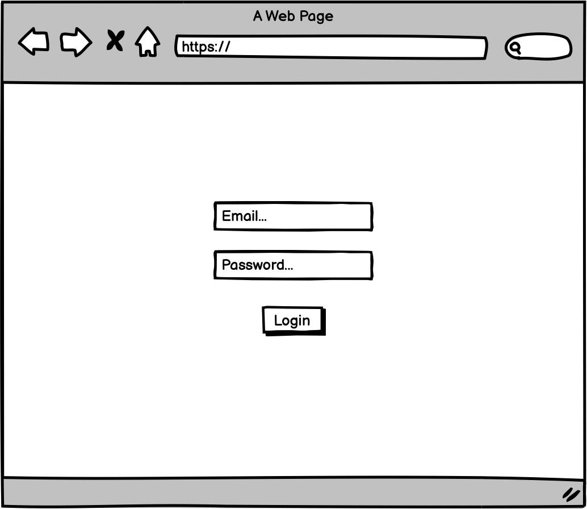
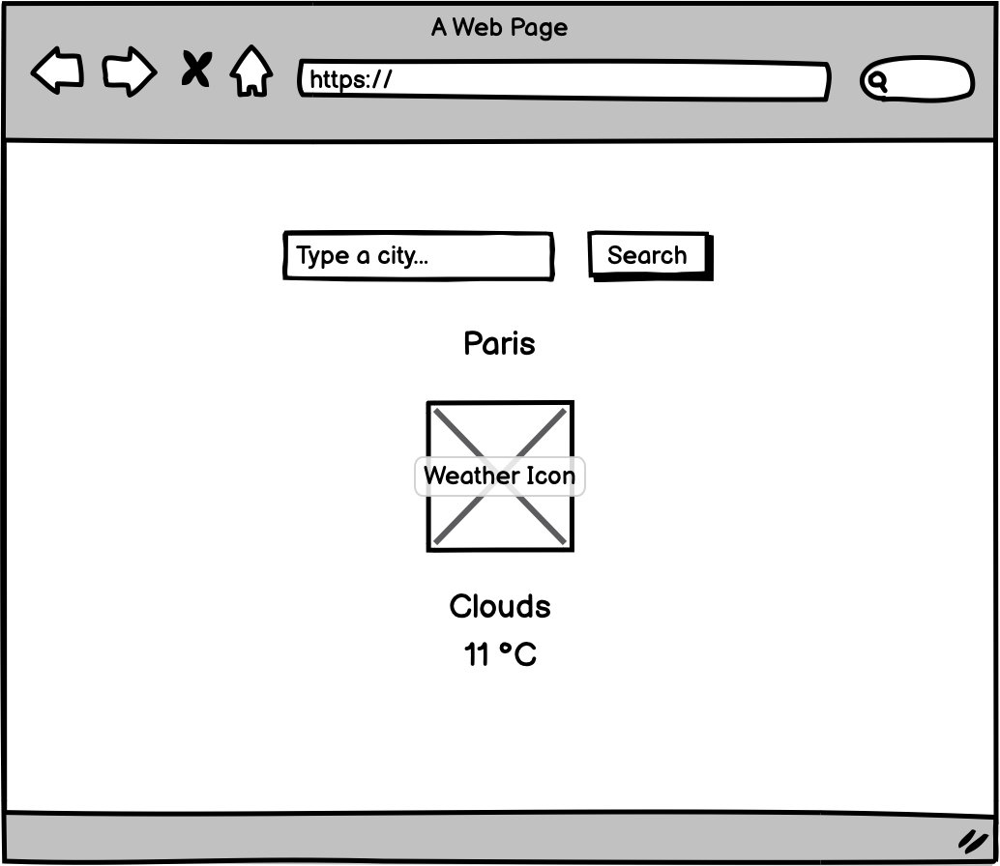

# Technical test React - Weather

> For confidentiality reasons, please do not fork this repository from GitHub. Create a new private repository on your account.

Hi 👋
---

This is an exercice about React.

## Goals

This exercise is the occasion for you to

- Give us an overview of your **thinking**
- Demonstrate the **redability** of your code
- Show your **architecture and quality** skills
- Have this work as a support to discuss technical topics

## Guidelines

- The provided screenshots are only indicative. You can be creative and show us your skills about UI, it will be appreciated.
- We will also appreciate work on quality, like providing unit tests - a Storybook or a coverage report

## Getting started

This project uses create-react-app. Instructions are available on [REACT.md](./REACT.md) or on the [CRA website](https://create-react-app.dev/)

## Work to do

We'd like you to create an app that shows weather for a city. It will be protected by a login screen.

You may use two APIs:
- https://reqres.in/ for authentication
- https://graphql-weather-api.herokuapp.com/ for weather data

Using React hooks, you will create:
- A **login page**
- A **page where we search a city and show the weather if the city is recognized**

We know that it will not be a "real" authentication, so you may just store in the browser if the user is logged in or not.

## Wireframes

## Any question ?

If some points aren't clear to you, no worries we can have a quick chat.
Send me an email at maxime@scoppe.fr.

## When you're done

Share your repository with @maximelebastard on GitHub and drop an email to maxime@scoppe.fr.